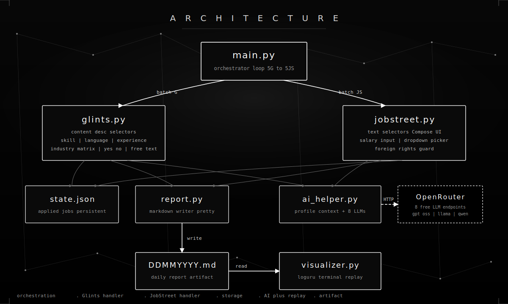

<div align="center">


### Bot lamaran kerja otomatis untuk Glints sama JobStreet di Android
### Zero human in the loop, jalan via ADB di HP beneran

</div>

<br/>

## Apaan Sih Ini

Bot ini handle proses lamar kerja dari A sampai Z di Glints dan JobStreet, full otomatis, pakai HP fisik yang konek ke laptop via ADB. Dia bisa:

- Buka aplikasi, scroll feed, search by keyword
- Klik card lowongan, baca detail, tap tombol apply
- Isi form HRD step demi step (CV, pertanyaan skill, bahasa, pengalaman, gaji)
- Jawab pertanyaan teks bebas pake LLM gratis (OpenRouter)
- Submit lamaran, balik ke feed, lanjut lamaran berikutnya
- Catat semua di file Markdown harian yang rapi

Ada juga visualizer keren yang replay laporan harian seolah olah lagi nge scan live di terminal pakai loguru.

<br/>

## Fitur Andalan

<table>
<tr>
<td valign="top" width="33%">

**Dua platform sekaligus**

Glints (React Native, selector pake content desc) sama JobStreet (Compose, selector pake text). Masing masing punya handler sendiri sesuai kuirk UI nya.

</td>
<td valign="top" width="33%">

**Filter ketat**

Minimal gaji 8 juta. Blacklist 4 perusahaan. Fuzzy match 60 lebih keyword posisi. Cek lokasi Jabodetabek. Detector lowongan luar negeri yang butuh work rights khusus.

</td>
<td valign="top" width="33%">

**Jawaban dibantu AI**

Pakai OpenRouter free model (gpt oss 120b, llama 3.3 70b, qwen3, gemma, deepseek). Kalau semua model down, fallback ke jawaban statis yang ditulis manual.

</td>
</tr>
<tr>
<td valign="top" width="33%">

**Handler pertanyaan form**

Skill matrix tap Ahli, bahasa tap Mahir Fasih, Ya atau Tidak, pengalaman 1 sampai 3 thn, industri tap Tidak Berpengalaman, salary input, dropdown picker pinter.

</td>
<td valign="top" width="33%">

**Recovery anti nyangkut**

Deteksi stuck via screen signature. Lowongan luar negeri di abort awal. Dialog "Discard application" auto closed. State di simpan di JSON jadi bisa lanjut habis crash.

</td>
<td valign="top" width="33%">

**Laporan + replay kosmetik**

Tiap hari otomatis bikin file Markdown rapi pakai table, blockquote, dan bullet. Visualizer loguru bisa replay seolah olah lagi running live, ada progress bar dan animated dots.

</td>
</tr>
</table>

<br/>

## Arsitektur

<div align="center">



</div>

Singkatnya, `main.py` orchestrator yang gilirin batch 5 Glints lalu 5 JobStreet. Handler per platform baca card dari feed, lewatin pipeline filter, buka detail, isi form, lalu submit. Setiap sukses bakal di tulis ke `report.py` jadi file `DDMMYYYY.md` di folder `Lamaran`, dan ID nya di catat di `state.json` biar besok besok ga di lamar lagi. Kalau ada pertanyaan teks bebas, dilempar ke `ai_helper.py` yang panggil OpenRouter. Buat replay, tinggal jalanin `visualizer.py`.

<br/>

## Cara Pake

```powershell
# 1. Install dependency
pip install -r automation/requirements.txt

# 2. Konek HP via USB, aktifin USB debugging
adb devices

# 3. Install helper APK uiautomator2 (sekali aja)
python -m uiautomator2 init

# 4. (Opsional) set API key OpenRouter buat AI text answer
$env:OPENROUTER_API_KEY = "sk-or-v1-..."

# 5. Jalanin full automation, bergantian Glints terus JobStreet
python automation/main.py

# 6. Atau cuma satu platform aja
python automation/main.py jobstreet
python automation/main.py glints

# 7. Replay laporan hari ini di terminal, keren abis
python automation/visualizer.py
python automation/visualizer.py --fast
```

<br/>

## Struktur Folder

```
automation/
  main.py              entry point, gilir 5G dan 5JS
  glints.py            handler Glints, pake content desc
  jobstreet.py         handler JobStreet, pake text plus dropdown picker
  ai_helper.py         klien OpenRouter, prompt dari profile Yoel
  report.py            writer markdown rapi (table, blockquote, bullet)
  state_manager.py     JSON state (applied jobs, login flag)
  config.py            device serial, blacklist, fuzzy keywords
  adb_utils.py         wrapper ADB subprocess
  visualizer.py        replay laporan pake loguru
  reformat_report.py   convert laporan format lama jadi MD baru
  requirements.txt
  README.md
  assets/
    banner.svg         banner di paling atas readme
    architecture.svg   diagram arsitektur

profile/
  yoel_profile.json    konteks CV buat AI answer
  Yoel_Andreas_Manoppo_Resume.docx

Lamaran/
  DDMMYYYY.md          laporan harian per tanggal

steps/
  glints/flow.md       catatan flow UI hasil HITL exploration
  jobstreet/flow.md
```

<br/>

## Cara Kerja

### Deteksi kartu lowongan

Dua dua aplikasi pake feed yang bisa di scroll. Bot dump UI hierarchy via uiautomator2, terus filter node clickable focusable yang lebar nya lebih dari 800 px dan tinggi lebih dari 300 px. Glints kasih data via `content desc` yang ada newline, JobStreet kasih via `text` di `android.widget.TextView`.

### Pipeline filter

Tiap kartu yang ke detek bakal lewatin urutan filter ini:

1. Cek state, udah pernah di lamar atau belum
2. Cek blacklist 4 perusahaan
3. Cek gaji minimum 8 juta
4. Cek fuzzy match 60 lebih keyword posisi
5. Cek lokasi (Jabodetabek untuk Glints, anti luar negeri untuk JobStreet)

Kartu yang gagal salah satu cek bakal di tandai "applied" di state biar gak di coba lagi.

### Penyelesaian form

**Glints** pake 4 step popover. Tiap step bisa salah satu dari:

- Konfirmasi dokumen (CV udah otomatis dari profile)
- Skill proficiency matrix (tap Ahli per row)
- Language proficiency (tap Mahir Fasih)
- Range pengalaman (tap 1 sampai 3 thn)
- Industry matrix (tap Tidak Berpengalaman per row, buat industri yang Yoel ga ada pengalaman)
- Pertanyaan Ya atau Tidak (default Ya)
- Free text EditText (di generate sama LLM via `ai_helper`)

**JobStreet** pake 4 step bottom sheet. Step 2 nya khusus, sering ada pertanyaan custom kayak:

- Multi select dropdown (pilih opsi yang paling nyambung)
- Salary input numerik (auto isi 10 juta)
- Single select dropdown (year range, English level, education, notice period)

Bot scroll loop sampai semua kebantu, kalau ada dialog "Answers required for all questions" tinggal di OK in lalu balik scroll up cari field kosong. Step 4 scroll cari tombol Submit application dan konfirmasi success.

### Jawaban LLM

Pas ada EditText free text dan teks pertanyaan keliatan beneran (panjang minimal, ada tanda tanya atau kata tanya), bot panggil `ai_helper.answer_question`. Coba tiap model berurutan:

```
openai/gpt oss 120b free
meta llama 3.3 70b free
qwen3 next 80b free
z ai glm 4.5 air free
deepseek v4 flash free
google gemma 4 31b free
nvidia nemotron nano 9b v2 free
meta llama 3.2 3b free
```

Jawaban di sanitize buat ADB input, terus di type chunk per chunk. Counter widget `0 of 500` di pake buat verifikasi field beneran ke isi.

### State persistence dan retry

`state.json` simpan ID lamaran (platform pipe company pipe position) plus flag login Glints. Kalau form gagal di tengah, bot **gak** nandain applied (biar besok bisa di coba lagi), tapi hash card di tambahin ke set `_seen` in process biar gak loop di card yang sama dalam satu run.

<br/>

## Contoh CLI

```powershell
# Default: gilir Glints terus JobStreet, batch 5
python automation/main.py

# Glints aja
python automation/main.py glints

# JobStreet aja (lebih cepet, tanpa overhead Glints)
python automation/main.py jobstreet

# Replay laporan hari ini, animated
python automation/visualizer.py

# Replay tanggal spesifik tanpa delay
python automation/visualizer.py 17052026.md --fast

# Reformat laporan format lama jadi format baru yang rapi
python automation/reformat_report.py
```

<br/>

## Preview Visualizer

Visualizer nge stream replay sequential pake progress bar, per app context logger (scanner, parser, filter, apply, report), spinner pas simulate wait, dan summary panel di paling akhir. Total lamaran sengaja di taro di belakang biar feel nya kayak beneran lagi cari satu satu, bukan langsung tau dari awal.

```
12:08:15.421 INFO     system         Initializing job scan engine
12:08:15.728 INFO     system         Connecting to ADB device 13344254B7000215
12:08:16.041 SUCCESS  system         Connected to S686LN OP Android 35
12:08:16.357 INFO     system         Worker pool ready, starting scan

  [PROGRESS] [#####...............................] 5/97  5.2% scanning feed

12:08:17.812 DEBUG    scanner        Scanning Glints feed cards
12:08:18.054 INFO     parser         Extracting card metadata
12:08:18.187 SUCCESS  parser         COMPANY  : PT Imani Prima
12:08:18.302 SUCCESS  parser         POSITION : IT Support Engineer
12:08:18.418 SUCCESS  parser         SALARY   : Rp 6.000.000 hingga Rp 10.000.000
12:08:18.601 SUCCESS  filter         All checks PASSED
12:08:18.835 SUCCESS  apply.gli      Step 4 of 4 SUBMIT
12:08:18.940 SUCCESS  report         Application sent at 02:42
```

<br/>

## Konfigurasi

Edit `automation/config.py` buat tuning kelakuan bot.

| Setting | Default | Artinya |
| :--- | :--- | :--- |
| DEVICE_SERIAL | 13344254B7000215 | ADB serial HP target |
| MIN_SALARY | 8000000 | Reject lowongan di bawah angka ini |
| BATCH_SIZE | 5 | Jumlah lamaran per batch per platform per round |
| T_TAP | 0.15 | Jeda setelah tap biasa |
| T_ANIM | 0.35 | Jeda setelah animasi transisi |
| T_LAUNCH | 3.0 | Jeda setelah launch app |
| BLACKLIST_COMPANIES | 4 item | Perusahaan yang wajib di skip |
| FUZZY_KEYWORDS | 60 plus | Keyword posisi buat fuzzy match |

<br/>

## Catatan

Bot ini gua bikin buat keperluan job hunting pribadi (Yoel Andreas Manoppo). Pake yang bertanggung jawab, jangan spam recruiter. Tetep cek laporan harian dan follow up manual buat offer yang paling cocok.

<br/>

## Lisensi

MIT. Bawa profile sendiri, HP sendiri, kopi sendiri.
