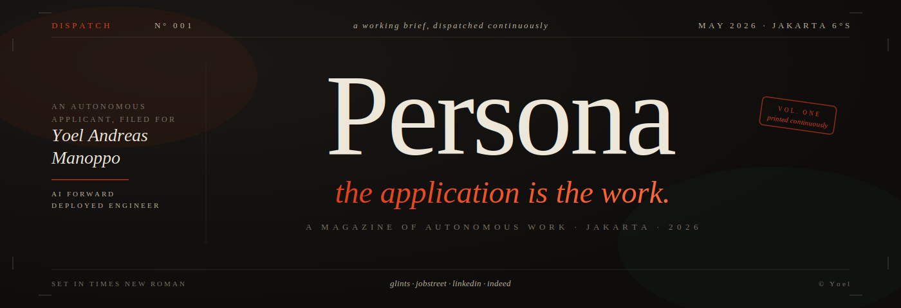
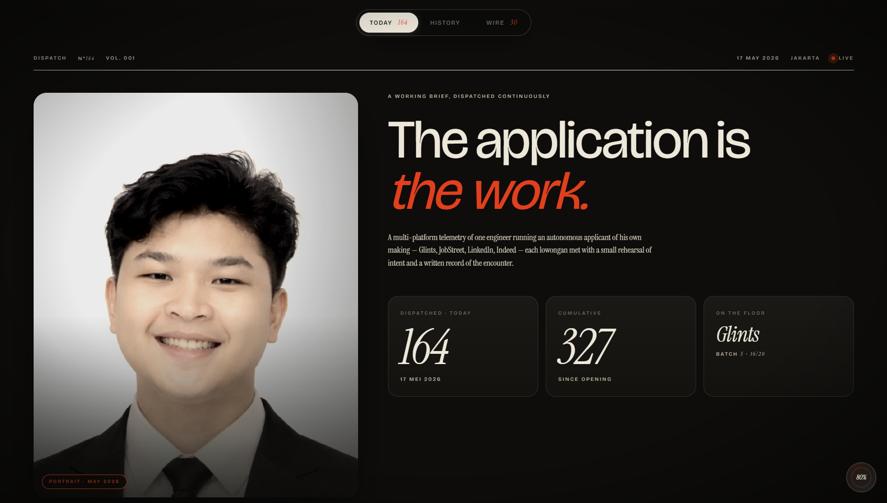
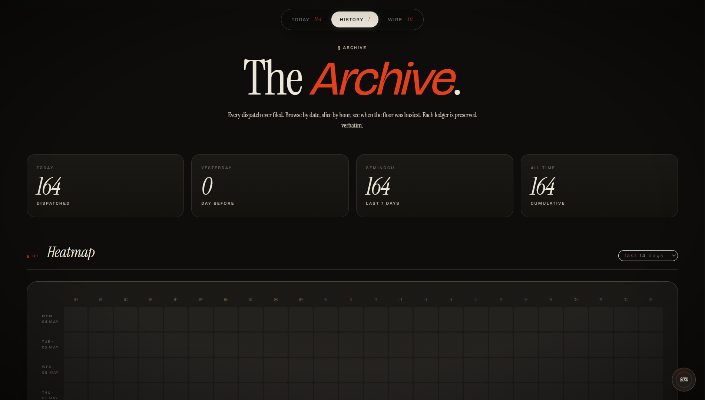
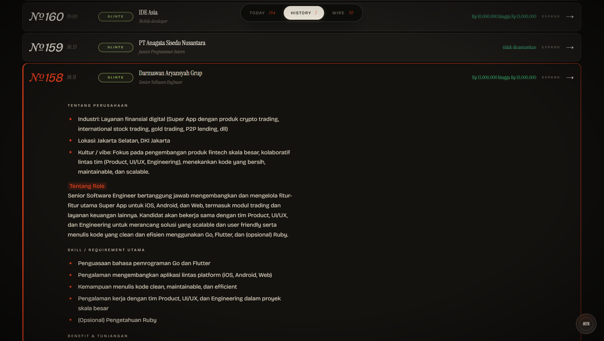
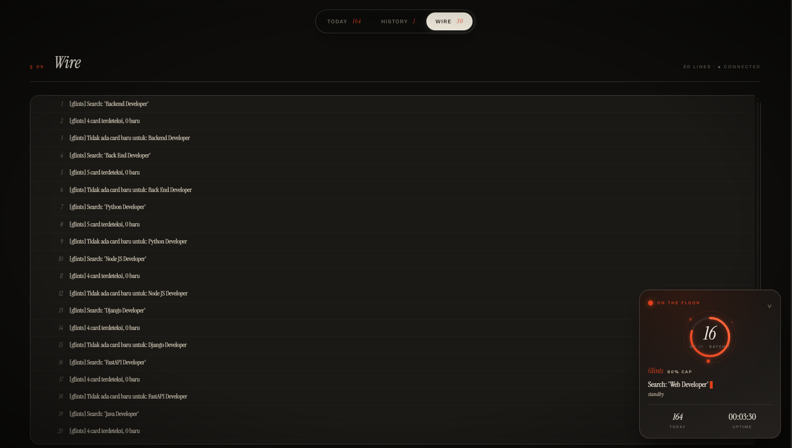
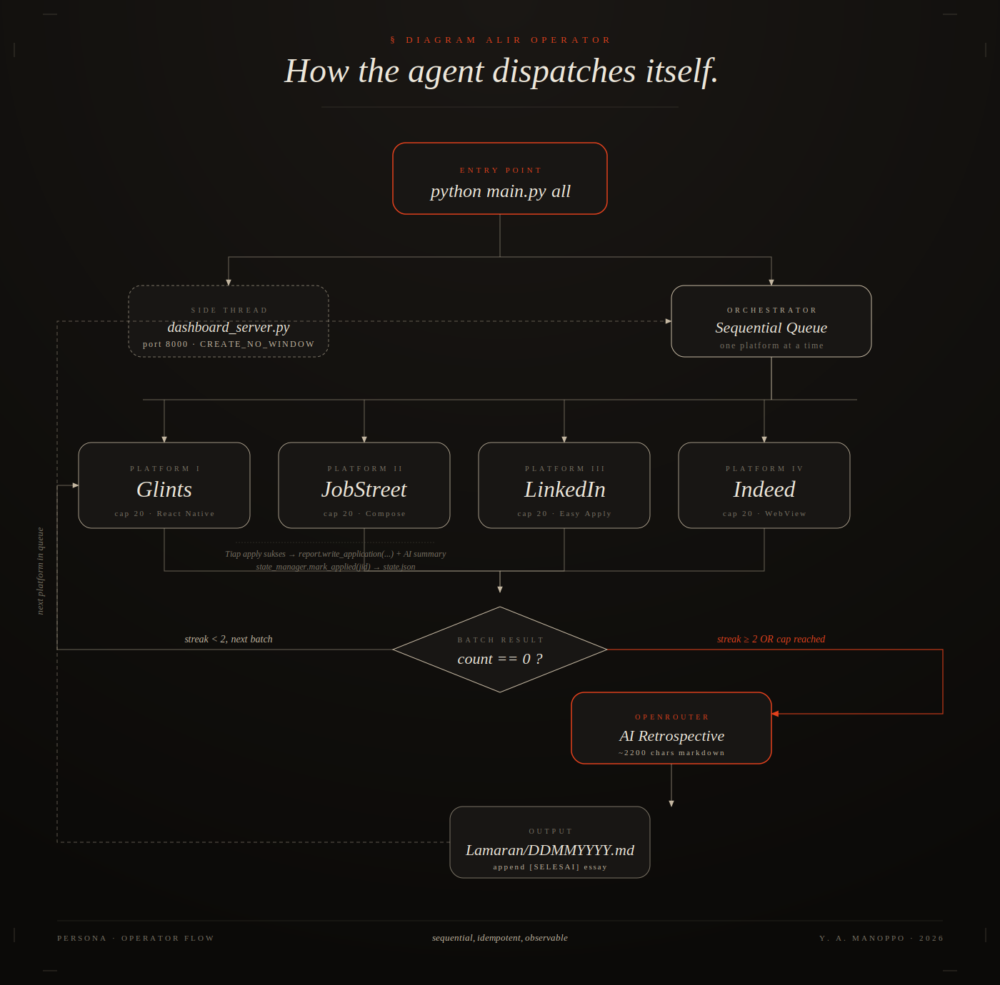

<div align="center">



<br/>

<sub>
<b>An autonomous applicant for Yoel Andreas Manoppo</b><br/>
Agent lamaran kerja Android. ADB-driven. Multi-platform. Editorial dashboard.<br/>
<i>Mengirim brief kerja secara terus-menerus, satu lowongan pada satu waktu.</i>
</sub>

<br/><br/>


</div>

<br/>

> Tidak ada human di dalam loop, sampai loop itu sendiri yang minta perhatian.
> Agent ini scan feed Glints, JobStreet, LinkedIn, dan Indeed, lalu mengisi setiap form
> aplikasi dengan jawaban yang di-generate AI dari profile asli Yoel. Tiap lamaran
> ditulis ke laporan markdown harian. Setiap platform yang tamat dapat retrospective AI
> dengan saran improvement untuk Yoel.

<br/>

<div align="center">

<br/><sub><i>Today · cover spread dengan portrait Yoel, headline editorial, dan tiga metrik primer.</i></sub>
</div>

<br/>

## Apa Ini, Sebenarnya

Sebuah sistem dengan **empat lapisan**, tinggal di laptop tapi mengoperasikan HP fisik Yoel:

| Lapisan | Bahan | Tugas |
|---|---|---|
| **Operator** | `automation/main.py` | Orkestrator. Run platform sequential sampai cap 20 atau zero-streak |
| **Handler** | `glints.py` · `jobstreet.py` · `linkedin.py` · `indeed.py` | Scrape feed, klik kartu, isi form 4-step, submit |
| **Otak** | `ai_helper.py` (OpenRouter free tier) | Jawab pertanyaan form, tulis summary perusahaan, generate retrospective |
| **Mata** | `dashboard_server.py` + `dashboard_static/index.html` | Live dashboard editorial di port 8000 |

Setiap apply yang berhasil → catat ke `Lamaran/DDMMYYYY.md` dengan AI summary lengkap (kultur perusahaan, role, skill requirement, benefit, fit-score untuk Yoel). Tiap platform yang tamat → satu essay retrospective di file yang sama.

<br/>

## Empat Halaman, Bukan Satu Dashboard

Ini bukan admin panel SaaS biasa. Lebih dekat ke **majalah cetak yang terbuka di atas meja operator**, mengupdate diri sendiri setiap tiga detik.

<table>
<tr>
<td width="50%" valign="top">

### § 01 · Today


<sub>**Editorial cover.** Portrait Yoel di kiri (sepia, hover full-color), headline serif besar, tiga metrik utama: Dispatched · Cumulative · On the Floor. Nav pill atas: Today / History / Wire.</sub>

</td>
<td width="50%" valign="top">

### § 02 · History · Archive


<sub>**Arsip & heatmap.** Empat agregat (today / yesterday / 7-day / cumulative). Heatmap 14 hari × 24 jam dengan intensitas vermillion. Date picker DDMMYYYY, time range slider, filter platform.</sub>

</td>
</tr>
<tr>
<td width="50%" valign="top">

### § 03 · Ledger


<sub>**Daftar lamaran harian.** Setiap baris expandable. Index editorial № besar italic. Drop-cap AI summary dengan section "Tentang Perusahaan", "Tentang Role", "Skill Utama", "Benefit", dan "Cocok untuk Yoel?".</sub>

</td>
<td width="50%" valign="top">

### § 04 · Wire + Floating Dock


<sub>**Live log via SSE** dalam tipografi serif editorial. Bottom-right ada **floating CD-style dock**: progress lingkaran dengan orbit dots, angka aktual di tengah, ticker uptime selalu kelihatan saat scroll.</sub>

</td>
</tr>
</table>

<br/>

## Cara Jalanin (30 Detik)

```powershell
# 1. Install dependency
pip install -r automation/requirements.txt

# 2. Konek HP via USB, aktifin USB debugging
adb devices

# 3. Install helper APK uiautomator2 (sekali aja)
python -m uiautomator2 init

# 4. Isi .env di root project dengan API key OpenRouter
#    OPENROUTER_API_KEY=sk-or-v1-...
notepad .env

# 5. Jalanin full automation (Glints -> JS -> LinkedIn -> Indeed sequential,
#    cap 20 per platform, auto rotate ke berikutnya kalau tamat atau zero-streak)
python automation/main.py all

# 6. Atau cuma satu platform
python automation/main.py glints
python automation/main.py jobstreet
python automation/main.py linkedin
python automation/main.py indeed

# 7. Tanpa dashboard (silent total)
python automation/main.py all --no-dashboard

# 8. Replay laporan hari ini di terminal
python automation/visualizer.py
```

Dashboard auto-spawn di `http://127.0.0.1:8000` saat `main.py` start. Tidak ada jendela CMD tambahan (`CREATE_NO_WINDOW` flag di subprocess).

<br/>

## Filter Pipeline

Sebelum satu lamaran pun dikirim, kartu lowongan harus lewat **enam saringan berurutan**:

```
   ┌────────────────────┐
   │ KARTU TERDETEKSI   │
   └──────────┬─────────┘
              │
       1. ✗ STATE        sudah pernah di-apply? skip diam-diam
              │
       2. ✗ BLACKLIST    perusahaan eks-Yoel? lewat
              │
       3. ✗ SALARY       di bawah Rp 8.000.000? lewat
              │
       4. ✗ FUZZY        title cocok 60+ keyword profile? lewat
              │
       5. ✗ LOCATION     Jabodetabek only (Glints) / no-foreign (JS)? lewat
              │
       6. ✗ FOREIGN      butuh work rights asing? abort
              │
              ↓
   ┌────────────────────┐
   │   READY TO APPLY   │
   └────────────────────┘
```

Setiap skip dicatat di counter session saat platform tamat, counter ini dikirim ke AI untuk retrospective ("Mengapa Glints sudah selesai hari ini").

<br/>

## Jawaban AI yang Tidak Boilerplate

`ai_helper.py` punya **tiga fungsi** yang sama-sama panggil OpenRouter free tier (gpt-oss-120b, llama-3.3-70b, qwen3-next-80b, glm-4.5, deepseek, gemma, dll. dengan fallback cascade):

| Fungsi | Dipanggil saat | Output |
|---|---|---|
| `answer_question(q)` | EditText kosong di form HRD | 1 paragraf, contextual ke profile + bahasa form |
| `summarize_job(raw, company, position)` | Lamaran sukses submit | Markdown 5-section: Tentang Perusahaan / Role / Skill / Benefit / Fit untuk Yoel |
| `platform_retrospective(name, total, counters, samples)` | Platform tamat (cap atau zero-streak) | Essay 4-section: Mengapa selesai / Pola skip / Rekomendasi improvement / Strategi besok |

**Aturan keras**: `_static_answer()` fallback hanya jalan kalau seluruh kaskade model gagal. Dengan dotenv yang ter-load benar, AI 100% dipakai.

Untuk pertanyaan Yes/No (mis. *"Apakah Anda bersedia bekerja full on-site di Kebon Jeruk?"*), AI tidak akan menulis essay; ia jawab **"Ya, saya bersedia bekerja full on-site di Kebon Jeruk, Jakarta Barat."** sesuai bahasa dan konteks pertanyaan.

<br/>

## Form Handler per Platform

Setiap platform punya quirk UI sendiri. Agent punya handler dedicated:

### Glints (React Native, `content-desc` based)

Form pop-up multi-step. Agent tangani:
- **Konfirmasi dokumen** (CV otomatis dari profile)
- **Skill matrix** tap "Ahli" per row untuk semua skill (deteksi via `Mahir-Fasih`, `Ahli`)
- **Language matrix** tap "Mahir-Fasih" untuk Indonesia, Inggris (C2), Mandarin
- **Range pengalaman** tap "1-3 thn" sebagai default 3-year experience
- **Industry matrix** tap "Tidak Berpengalaman" per industri yang Yoel ga sentuh
- **Yes/No question** default Ya, di-confirm via AI kalau ambigu
- **Free text EditText** di-fill via `ai_helper.answer_question()` dengan adb input text
- **Dialog "Ada syarat tidak sesuai"** auto LANJUTKAN kalau Jabodetabek, BATALKAN kalau di luar

### JobStreet (Compose, modal-based search)

Search bar JobStreet **bukan** inline input. Flow yang benar:

```
Tap "Continue your job search" (top)
    → MODAL terbuka (Describe field, Enter suburb, filters, SEEK button)
Tap "Describe what you're looking for"
    → SUGGESTION PAGE terbuka (full-screen keyword input)
Type "AI Engineer" via adb input text
Press KEYCODE_ENTER
    → kembali ke modal, field terisi, tombol jadi "SEEK 230 Jobs"
Tap SEEK (via xpath textStartsWith="SEEK ")
    → RESULTS PAGE
```

Apply flow: tap kartu (via xpath title bounds, bukan card center karena ada bookmark icon di kanan), tap "Quick apply", lalu Step 1-4: Documents → Questions → Profile → Review & Submit.

### LinkedIn (Easy Apply via Workable)

Workable form 4-page biasanya pre-filled dari LinkedIn profile. Agent:
- Tap "Top job picks for you" feed (sudah personalized)
- Filter via "Easy Apply" badge dalam card subtree
- Tap detail → tap "Easy Apply" → loop Next / Review / Submit
- Skip kalau form > 4 pages (essay-heavy, belum reliable di-auto-fill)

### Indeed (WebView form)

Form Indeed adalah webview hybrid. Agent:
- Tap "Beranda" tab bottom nav
- Iterate card dengan badge "Easily apply"
- Tap "Lamar sekarang" → form load (kadang lambat 8s+)
- Step 1 (Resume): pre-selected, scroll bawah, tap Continue
- Step 2+ (Questions): radio Yes/No detect, text input via AI
- Submit kalau ke "Review and submit" page

<br/>

## Arsitektur File

```
persona/
├── .env                          # OPENROUTER_API_KEY=sk-or-v1-...
├── README.md                     # ← anda di sini
│
├── profile/
│   ├── yoel_profile.json         # konteks AI: pengalaman, skill, ekspektasi
│   └── Yoel_Andreas_Manoppo_Resume.docx
│
├── Lamaran/
│   └── DDMMYYYY.md               # laporan harian, append per apply
│
└── automation/
    ├── main.py                   # orkestrator sequential mode
    ├── config.py                 # device serial, blacklist, fuzzy keywords, MIN_SALARY
    │
    ├── glints.py                 # handler React Native via content-desc
    ├── jobstreet.py              # handler Compose via text + modal-based search
    ├── linkedin.py               # handler Easy Apply via top picks
    ├── indeed.py                 # handler WebView form
    │
    ├── ai_helper.py              # OpenRouter klien, 3 fungsi (answer/summary/retro)
    ├── report.py                 # writer markdown rapi, AI summary embedded
    ├── state_manager.py          # JSON state (applied jobs, jobstreet_logged_in)
    ├── adb_utils.py              # wrapper ADB subprocess
    ├── visualizer.py             # replay laporan di terminal pake loguru
    │
    ├── dashboard_server.py       # FastAPI + SSE, port 8000
    ├── dashboard_parsers.py      # parse markdown reports + log untuk dashboard
    ├── dashboard_static/
    │   ├── index.html            # single-page editorial dashboard
    │   ├── d1.png …d4.png        # screenshot dashboard untuk README ini
    │   └── current.png           # device screenshot (deprecated)
    │
    ├── requirements.txt
    └── assets/
        ├── banner.svg            # banner lama (deprecated)
        ├── architecture.svg
        ├── dispatch_title.svg    # title Times New Roman di README ini
        └── logo.png
```

<br/>

## Diagram Alir Operator

<div align="center">

<br/><sub><i>SVG bertekstur, kotak dengan jarak luas, monochrome dengan aksen vermillion untuk titik kritis (entry, retrospective, terminal arrow).</i></sub>
</div>

<br/>

## Disclosure & Etika

> Agent ini berbuat seolah-olah Yoel-lah yang sedang melamar. Setiap submission punya kekuatan hukum dan persepsi yang sama dengan kalau Yoel manual mengirimnya. Karena itu:

- Profile yang dipakai **harus akurat** `profile/yoel_profile.json` adalah ground truth, tidak boleh dibuat-buat skill yang Yoel ga punya
- AI **tidak boleh berbohong** di form ("Apakah punya pengalaman dengan X?" → kalau profile tidak menyebut X, jawab **Tidak**)
- Volume harian **dijaga di bawah threshold ATS spam-detection**: cap 20 per platform, jeda natural antar apply
- Salary expectation di profile = Rp 10.000.000 → filter `MIN_SALARY = 8.000.000` (toleransi 20% bawah)
- Lokasi non-Jabodetabek di-cancel otomatis, kecuali lowongan eksplisit remote-friendly

Volume tinggi (>100/hari) kadang **counterproductive**. Mass-apply menurunkan signal-to-noise di mata recruiter. Agent ini paling efektif sebagai *first-pass coverage* lamaran kelas senior (>Rp 15jt) sebaiknya tetap dilakukan **manual dengan tailored cover letter + portfolio link**.

<br/>

## Roadmap Kecil

- [x] Sequential mode dengan cap per platform
- [x] AI summary per apply + AI retrospective per platform
- [x] Live dashboard editorial dengan 4 views
- [x] Floating CD-style progress dock
- [x] Filter pipeline: state, blacklist, salary, fuzzy, location, foreign-rights
- [x] OpenRouter integration with cascade fallback
- [ ] **Pre-apply fit-score** (AI judge >70% match sebelum form-fill)
- [ ] **Salary parser fix** untuk koma decimal Indonesia (`5,8jt` jangan di-parse jadi 58jt)
- [ ] AI summary parity untuk JS + LinkedIn (sekarang baru Glints + Indeed)
- [ ] Telegram/Discord notify saat apply sukses
- [ ] Multi-day comparison di History page

<br/>

<div align="center">

<sub>
Crafted in Jakarta, 2026.<br/>
Set in <b>Instrument Serif</b>, <b>Bricolage Grotesque</b>, dan <b>Times New Roman</b>.<br/>
Dispatched continuously, edited rarely.
</sub>

</div>
